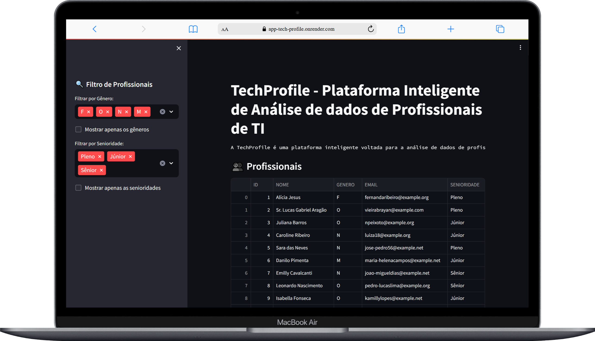
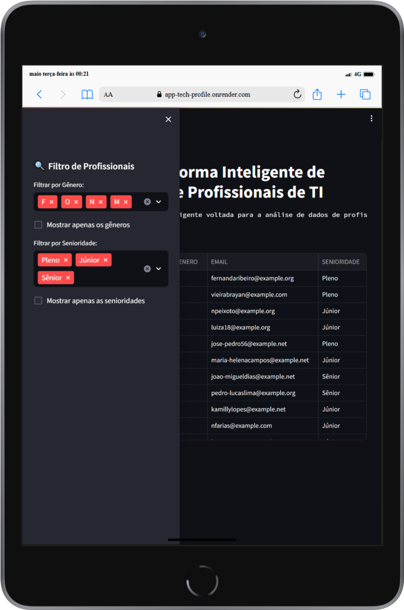
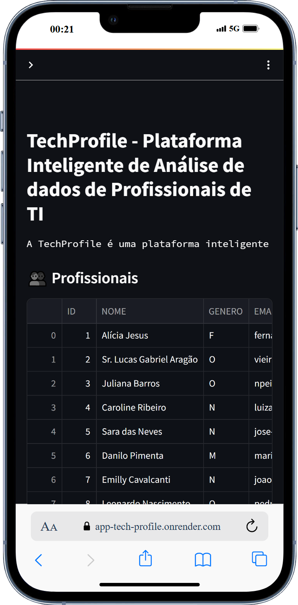

# App - TechProfile

## Descrição
Este projeto foi desenvolvido para aprimorar minhas habilidades como desenvolvedor fullstack, colocando em prática conceitos e tecnologias que domino.

## O que é o TechProfile?
O TechProfile é uma plataforma inteligente voltada para a análise de dados de profissionais de tecnologia. Você poderá filtrar e obter informações sobre profissionais, habilidades, experiências, salários e localização.

## Objetivos:
- Mostrar minhas habilidades técnicas com Streamlit, MySQL, Python, Pandas, dotenv e mais.
- Aplicar princípios de Clean Code, organização de pastas e mais.
- Ajudar iniciantes com códigos simples, legíveis e prontos para estudo.
- Apresentar meu estilo de trabalho para recrutadores e empresas de tecnologia.

## Funcionalidades
- [x] Sidebar com alguns filtros de profissionais. (Mais filtros em desenvolvimento)
- [x] Layout responsivo para Desktop, Tablet e Mobile.

## Tecnologias Utilizadas
- Python: Linguagem de programação principal utilizada para desenvolvimento do backend e manipulação de dados.
- Streamlit: Framework em Python para criação de aplicações web interativas e voltadas à visualização de dados.
- MySQL: Sistema de gerenciamento de banco de dados relacional utilizado para armazenar e consultar os dados da aplicação.
- Pandas: Biblioteca Python para análise e manipulação de dados, especialmente em estruturas como DataFrames.
- dotenv: Biblioteca Python usada para carregar variáveis de ambiente a partir de arquivos .env, facilitando a configuração segura de credenciais e conexões.

## 📸 Screenshots
<div align="center">
  <h3>Versão para Desktop</h3>
  
</div>
<br>

<div align="center">
  <h3>Versão para Tablet</h3>
  
</div>
<br>

<div align="center">
  <h3>Versão para Mobile</h3>
  
</div>

##  Como rodar o projeto localmente
## Clone o repositório
```bash
git clone https://github.com/jcddsj01/app-tech-profile.git
```

## Acesse a pasta do projeto
```bash
cd app-tech-profile
```

## Crie um ambiente virtual
Sistema Windows (cmd)
```bash
python -m venv nome-ambiente
```
Sistema Linux
```bash
python3 -m venv nome-ambiente
```

## Ativar o ambiente virtual
Sistema Windows (cmd)
```bash
nome-ambiente\Scripts\activate
```
Sistema Linux
```bash
source nome-ambiente/bin/activate
```

## Instale as dependências 
Sistema Windows (cmd) e Linux
```bash
pip install -r requirements.txt
```

## Baixar e instalar o MySQL (ou alguma ferramenta de administração de bases de dados)
MySQL Workbench
https://dev.mysql.com/downloads/workbench/<br>
DBeaver (outra opção)
https://dbeaver.io/download/

## Criar o banco de dados, tabelas e relacionamentos
Executar o arquivo no Windows (cmd)
```bash
python criar_banco_de_dados_e_tabelas.py
```
Executar o arquivo no Linux
```bash
python3 criar_banco_de_dados_e_tabelas.py
```

## Inicie o servidor Streamlit
```bash
streamlit run app.py
```

## 📁 Estrutura de Pastas
📦banco_de_dados<br>
 ┣ 📂datasets<br>
 ┗ 📂scripts<br>
📦documentos<br>
📦public<br>
 ┗ 📂screenshots

## Deploy (Frontend)
O projeto está disponível online no Render:
https://app-tech-profile.onrender.com/

Para conhecer o Render -> https://render.com/

## Banco de dados (Backend) no Railway
Para conhecer o Railway -> https://railway.com/

## Contato
Sinta-se à vontade para me contatar através dos links abaixo:<br>
E-mail - jcddsj01@outlook.com<br>
Linkedin - https://www.linkedin.com/in/jose-carlos-703821254/

## Licença<br>
MIT License. Você pode usar este projeto como referência para criar o seu próprio portfólio.

---

# App - TechProfile

## Description
This project was developed to improve my skills as a fullstack developer, putting into practice concepts and technologies that I have mastered.

## What is TechProfile?
TechProfile is an intelligent platform for analyzing data on technology professionals. You can filter and obtain information on professionals, skills, experience, salaries and location.

## Objectives:
- Showcase my technical skills with Streamlit, MySQL, Python, Pandas, dotenv and more.
- Apply Clean Code principles, folder organization and more.
- Help beginners with simple, readable and ready-to-study code.
- Present my work style to recruiters and technology companies.

## Features
- [x] Sidebar with some professional filters (More filters in development)
- [x] Responsive layout for Desktop, Tablet and Mobile.

## Technologies Used
- Python: Main programming language used for backend development and data manipulation.
- Streamlit: Python framework for creating interactive web applications and data visualization.
- MySQL: Relational database management system used to store and query application data.
- Pandas: Python library for analyzing and manipulating data, especially in structures such as DataFrames.
- dotenv: Python library used to load environment variables from .env files, facilitating the secure configuration of credentials and connections.

## 📸 Screenshots
<div align="center">
  <h3>Desktop version</h3>
  
</div>
<br>

<div align="center">
  <h3>Tablet version</h3>
  
</div>
<br>

<div align="center">
  <h3>Mobile version</h3>
  
</div>

## How to run the project locally
## Clone the repository
```bash
git clone https://github.com/jcddsj01/app-tech-profile.git
```

## Access the project folder
```bash
cd app-tech-profile
```

## Create a virtual environment
Windows system (cmd)
```bash
python -m venv name-environment
```
Sistema Linux
```bash
python3 -m venv name-environment
```

## Activate the virtual environment
Windows system (cmd)
```bash
name-environment\Scripts\activate
```
Linux system
```bash
source name-environment/bin/activate
```

## Install the dependencies 
Windows (cmd) and Linux systems
```bash
pip install -r requirements.txt
```

## Download and install MySQL (or any database administration tool)
MySQL Workbench
https://dev.mysql.com/downloads/workbench/<br>
DBeaver (other option)
https://dbeaver.io/download/

## Create the database, tables and relationships
Run the file in Windows (cmd)
```bash
python criar_banco_de_dados_e_tabelas.py
```
Running the file on Linux
```bash
python3 criar_banco_de_dados_e_tabelas.py
```

## Start the Streamlit server
```bash
streamlit run app.py
```

## 📁 Folder Structure
📦banco_de_dados<br>
 ┣ 📂datasets<br>
 ┗ 📂scripts<br>
📦documentos<br>
📦public<br>
 ┗ 📂screenshots

 ## Deploy (Frontend)
The project is available online at Render:
https://app-tech-profile.onrender.com/

To learn more about Render -> https://render.com/

## Database (Backend) in Railway
To learn more about Railway -> https://railway.com/

## Contact me
Feel free to contact me via the links below:<br>
E-mail - jcddsj01@outlook.com<br>
Linkedin - https://www.linkedin.com/in/jose-carlos-703821254/

## License<br>
MIT License. You can use this project as a reference to create your own portfolio.
